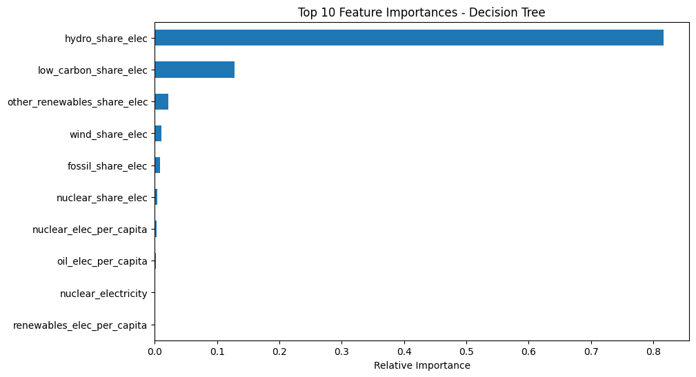

# **Enhanced Renewable Energy Adoption: Key Drivers Analysis**

## Author

Marco Narcisi

## **Executive Summary**

This report delves into the analysis of factors influencing renewable energy consumption, with the aim of providing stakeholders with actionable insights and guiding strategic decision-making towards a sustainable energy future. The analysis uses the World Energy Consumption Dataset and applies machine learning techniques to identify significant drivers.

## **Introduction**

 The transition to renewable energy is imperative for sustainability and energy security. This project leverages data analytics to understand the elements that contribute most significantly to renewable energy uptake.

## **Data Description**

The dataset comprises global energy data, focusing on the years 2000 to the present to maximize data completeness. It contains demographic, economic, and comprehensive energy consumption metrics.

## **Methodology**

 We conducted a systematic analysis, which included:

- Data exploration and cleaning to ensure robustness.
- Refinement by eliminating potential data leakage.
- Establishing a predictive model with three regression techniques chosen for their interpretability: Linear Regression, Decision Tree, and Random Forest.
- Feature importance analysis to identify the main influences on renewable energy consumption.

## **Findings and Insights**

 The feature importance analysis reveals the following:

- **Hydroelectric Share (`hydro_share_elec` - 81.72%)** is the dominant factor. The implication for stakeholders is to consider hydro resources as a cornerstone for increasing renewable energy shares.
- **Low-Carbon Energy Share (`low_carbon_share_elec` - 12.84%)** points to the significance of broad, low-carbon strategies that encompass multiple renewable and non-renewable sources.
- **Other Renewable Energies Share (`other_renewables_share_elec` - 2.18%)** suggests that investment in diverse renewable technologies, beyond hydro, can make meaningful contributions to energy consumption profiles.
- **Wind Energy Share (`wind_share_elec` - 1.11%)**, while less influential, highlights wind as another key renewable source.

Minor features such as fossil fuel dependency, nuclear energy, and per capita measures provide additional dimensions to consider when drafting policies or making investment decisions.

The charts provided in the appendix visually depict these feature importances and foster an understanding of their relative impact on energy consumption.

## **Recommendations**

- **Investment Strategy Focus**: Prioritize hydroelectric power developments, along with a balanced investment in wind, solar, and geothermal to foster a secure and diversified energy portfolio.
- **Policy Direction**: Create incentives and regulations that not only reduce traditional fossil fuel use but also promote a balanced mix of low-carbon and renewable sources.
- **Awareness and Efficiency**: Develop initiatives aimed at improving energy efficiency and raising awareness about energy consumption's per capita implications.

## **Next Steps**

Future analyses should:

- Extend to a causal examination of the identified features.
- Consider regional specificity to inform localized policy development.
- Include newly emerging data to refine models for predictive accuracy.

## **Conclusion**

This analysis provides a clear picture of factors influencing renewable energy shares with an emphasis on identifying actionable areas. The report serves as a beacon for strategic planning, supporting efforts to heighten the consumption of renewables in line with global sustainability goals.

## **Data Source and Acknowledgments**

*About Dataset:*

The dataset employed in this analysis pertains to energy consumption metrics maintained by the dataset "Our World in Data" on Kaggle and is regularly updated to include data on primary energy consumption, per capita rates, growth rates, energy mix, electricity mix, and other pertinent metrics.

*Source Data and Code:*

This dataset is curated from several datasets and involves multiple processing stages, originating from esteemed institutions such as the Energy Institute (EI), U.S. Energy Information Administration (EIA), The Shift Dataportal, and Ember, among others. The processing code and data aggregation methods utilize additional datasets regarding regions, population, income groups, and GDP.

*License:*

The dataset used in this project is licensed under the Creative Commons Attribution 4.0 International (CC BY 4.0) DEED, allowing for data sharing and utilization in analysis such as this report, provided there is proper attribution to the original source.

<div>
<div style="page-break-before: always;"></div>
</div>

## **Credits**

This analysis was conducted using a dataset compiled by Pralabh Poudel in the dataset "Our World in Data", which draws on a multitude of sources including but not limited to Statistical Review of World Energy by the Energy Institute (EI), International Energy Data from EIA, Energy from Fossil Fuels by The Shift Dataportal, Yearly Electricity Data and European Electricity Review by Ember. The complete dataset includes insightful variables crafted through comprehensive data processing. The consumption, electricity mix, and energy mix metrics provided facilitated a deeper understanding of renewable energy consumption patterns.

For more detailed insights and the original data compilation, please visit [Kaggle: World Energy Consumption](https://www.kaggle.com/datasets/pralabhpoudel/world-energy-consumption/data).

<div>
<div style="page-break-before: always;"></div>
</div>

## **Appendix: Visuals and Code**

<div>

</div>

```pyt
import pandas as pd
import numpy as np
from sklearn.model_selection import train_test_split
from sklearn.preprocessing import StandardScaler, OneHotEncoder
from sklearn.compose import ColumnTransformer
from sklearn.pipeline import Pipeline
from sklearn.impute import SimpleImputer
from sklearn.linear_model import LinearRegression
from sklearn.tree import DecisionTreeRegressor
from sklearn.ensemble import RandomForestRegressor
import matplotlib.pyplot as plt

# Load the cleaned data
df = pd.read_csv('path/to/cleaned_energy_data.csv')  # Update with your file path

# Remove the 'renewables_share_elec' feature from the dataset if it's contributing to data leakage
if 'renewables_share_elec' in df.columns:
    df = df.drop(columns=['renewables_share_elec'])

# Select features and target variable
X = df.drop(columns=['renewables_electricity_share'])
y = df['renewables_electricity_share']

# Check for NaN values in the target variable 'y'
y_isna_count = y.isna().sum()
print(f"Number of NaN values in y before: {y_isna_count}")

# Remove rows with NaN values in the 'y' target variable
y = y.dropna()
X = X.loc[y.index]

# Continue with train-test split and model fitting as before...
X_train, X_test, y_train, y_test = train_test_split(X, y, test_size=0.2, random_state=42)

# Identify categorical columns and numeric columns
categorical_cols = X.select_dtypes(include=['object']).columns
numeric_cols = X.select_dtypes(include=[np.number]).columns

# Create a ColumnTransformer to apply different preprocessing to categorical and numeric features
preprocessor = ColumnTransformer(
    transformers=[
        ('num', SimpleImputer(strategy='median'), numeric_cols),
        ('cat', OneHotEncoder(handle_unknown='ignore'), categorical_cols)
    ]
)

# Define the model pipelines
linear_pipeline = Pipeline(steps=[('preprocessor', preprocessor), ('model', LinearRegression())])
tree_pipeline = Pipeline(steps=[('preprocessor', preprocessor), ('model', DecisionTreeRegressor(random_state=42))])
forest_pipeline = Pipeline(steps=[('preprocessor', preprocessor), ('model', RandomForestRegressor(n_estimators=100, random_state=42))])

# Fit the pipelines
linear_pipeline.fit(X_train, y_train)
tree_pipeline.fit(X_train, y_train)
forest_pipeline.fit(X_train, y_train)

# Obtain the feature importances and one-hot encoded feature names from the pipelines
tree_feature_importances = tree_pipeline.named_steps['model'].feature_importances_
forest_feature_importances = forest_pipeline.named_steps['model'].feature_importances_
feature_names_transformed = preprocessor.transformers_[1][1].get_feature_names_out(categorical_cols)

# Combine numeric and transformed categorical feature names
all_feature_names = np.append(numeric_cols, feature_names_transformed)

# Plot feature importances for Decision Tree and Random Forest
def plot_feature_importances(importances, feature_names, model_name):
    importances_series = pd.Series(importances, index=feature_names)
    sorted_importances = importances_series.sort_values(ascending=False)[:10]
    
    plt.figure(figsize=(10, 6))
    sorted_importances.plot(kind='barh').invert_yaxis()
    plt.title(f'Top 10 Feature Importances - {model_name}')
    plt.xlabel('Relative Importance')
    plt.show()

plot_feature_importances(tree_feature_importances, all_feature_names, 'Decision Tree')
plot_feature_importances(forest_feature_importances, all_feature_names, 'Random Forest')
```


